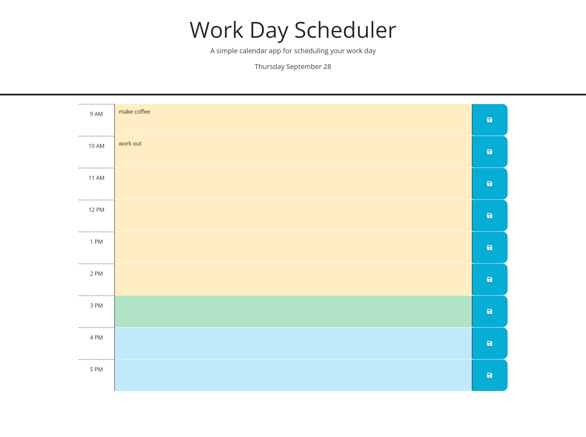

# Work Day Scheduler

## Description

This project is a calendar application that will allow the user to enter and save tasks to complete by hour during the course of a normal workday. The app time blocks dynamically changes colors throughout the day based on the time. Time blocks in the past are yellow, the current hour is in green and the future hours are in light blue. The user can enter a task into a specific time block and hit the save icon on the right of that block, and the information will be saved for them. It will also be available after a page reload.

Link to application:

<!-- add link to deployed site -->

## Usage

User can click on a specific colored time block and enter tasks to be completed. They can then hit the save icon on the right of that time block and save the data.

Screenshot of application

    

## Credits

Special thanks to Dominique Meeks Gombe, who provided tutoring and guidance to me while I was working on this project.

In completing this project, I utilized the below resources to assist:

https://www.w3schools.com/  
https://developer.mozilla.org/en-US/docs/Web/JavaScript/Reference/Template_literals  
https://developer.mozilla.org/en-US/docs/Web/API/setInterval  
https://coding-boot-camp.github.io/full-stack/github/professional-readme-guide  
https://www.markdownguide.org/basic-syntax/  
https://developer.mozilla.org/en-US/docs/Web/JavaScript/Reference/Statements/for...of  

## Badges

## How to Contribute

If you wish to contribute to this project, please reach out to the author.

